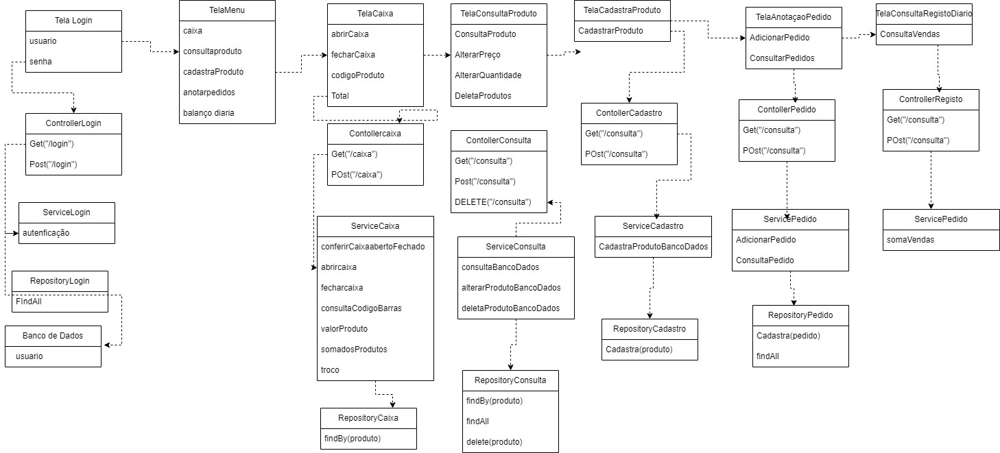
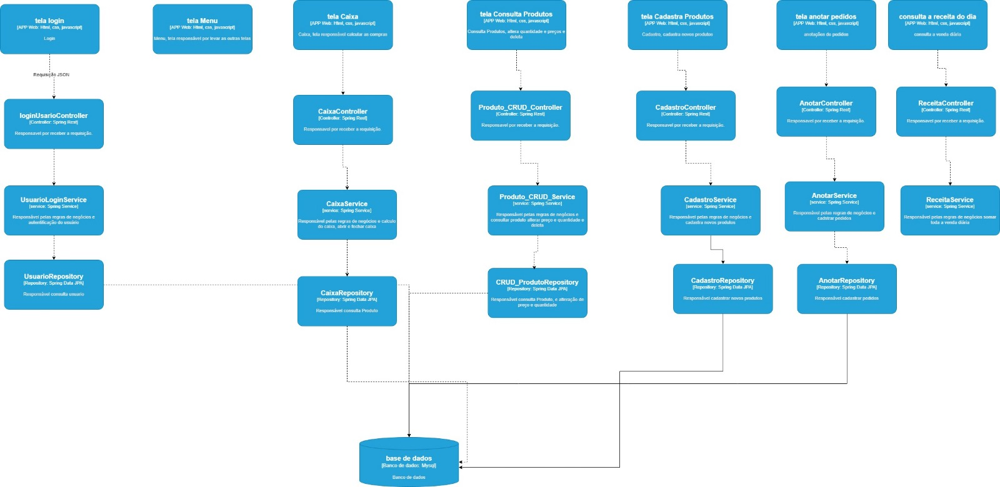
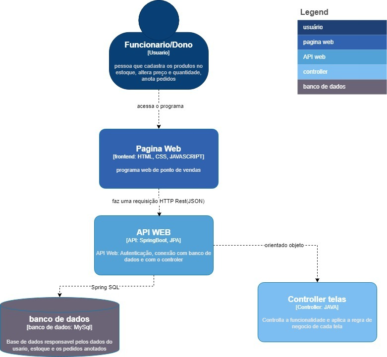
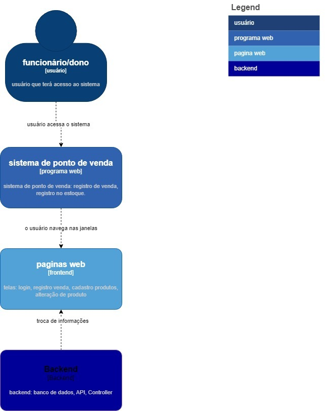

 🛒 Sistema PDV - Papelaria Planeta

Um sistema de ponto de venda (PDV) completo, desenvolvido do zero, incluindo toda a documentação e implementação.

 🚀 Sobre o Projeto
Este é um sistema PDV desenvolvido para atender às necessidades de pequenos e médios comércios, garantindo eficiência e segurança nas operações de venda. Todo o projeto foi idealizado, documentado e implementado por mim, com foco em boas práticas de desenvolvimento e arquitetura de software.

📌 Principais Funcionalidades
- Controle de estoque: Cadastro, edição e exclusão de produtos.
- Gestão de vendas: Registro de vendas diárias e histórico de transações.
- Fechamento de caixa: Cálculo automático do total vendido ao final do expediente.
- Autenticação segura: Geração de tokens JWT para controle de sessão.
- Controle de acesso: Usuários com níveis distintos (Administrador e Usuário comum).

🔒 Segurança e Autenticação
O sistema conta com um robusto esquema de segurança, incluindo:
- Autenticação JWT: Garante que apenas usuários autenticados acessem a API.
- Controle de acesso:
- Administrador: Pode gerenciar produtos, visualizar o histórico de vendas e acessar relatórios completos.
- Usuário comum: Apenas realiza operações de venda, sem acesso ao CRUD de produtos.

 🛠️ Tecnologias Utilizadas
- Back-end: Java Spring Boot
- Banco de Dados: MySQL
- Autenticação: Spring Security + JWT
- Documentação da API:  Modelo C4
- Front-end: HTML, CSS, JavaScript

  🔗 Acesse o Projeto
https://pdv-ponto-de-venda.netlify.app/

📂 Documentação e Modelo Relacional

Este projeto demonstra minha capacidade de desenvolver um sistema completo, desde a concepção e documentação até a implementação, segurança e integração do front-end com a API. 🚀

